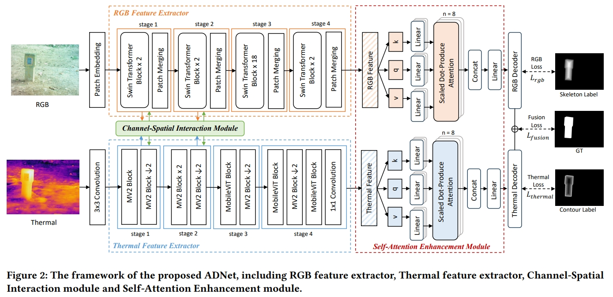

# ADNet: an asymmetric dual-stream network for RGB-T salient object detection(Proceedings of ACM International Conference on Multimedia in Asia (MMAsia'23))
This is the results of the MMAsia'23 paper "ADNet: an asymmetric dual-stream network for RGB-T salient object detection".


RGB-Thermal salient object detection (RGB-T SOD) aims to locate salient objects in images that include both RGB and thermal information. Previous approaches often suggest designing a symmetric network structure to tackle the challenge of dealing with low quality RGB or thermal images. However, we contend that RGB and thermal modalities possess different numbers of channels and disparities in information density. In this paper, we propose a novel asymmetric dual-stream network (ADNet). Specifically, we leverage
an asymmetric backbone to extract four stages of RGB features and four stages of thermal features. To enable effective interaction among low-level features in the first two stages, we introduce the Channel-Spatial Interaction (CSI) module. In the last two stages, deep features are enhanced using the Self-Attention Enhancement (SAE) module. Experimental results on the VT5000, VT1000, and VT821 datasets attest to the superior performance of our proposed ADNet compared to state-of-the-art methods.


## 🌟VT821 , VT1000 and VT5000 results
You can download the raw result by the following link
link：https://pan.baidu.com/s/1RnVKeLajMKVrj9jm_7FawA 
code：alzw 


## Citation 
Please cite this paper in your publications if it helps your research:

```
@inproceedings{fang2023adnet,
  title={ADNet: An Asymmetric Dual-Stream Network for RGB-T Salient Object Detection},
  author={Fang, Yaqun and Hou, Ruichao and Bei, Jia and Ren, Tongwei and Wu, Gangshan},
  booktitle={Proceedings of the 5th ACM International Conference on Multimedia in Asia},
  pages={1--7},
  year={2023}
}
```


